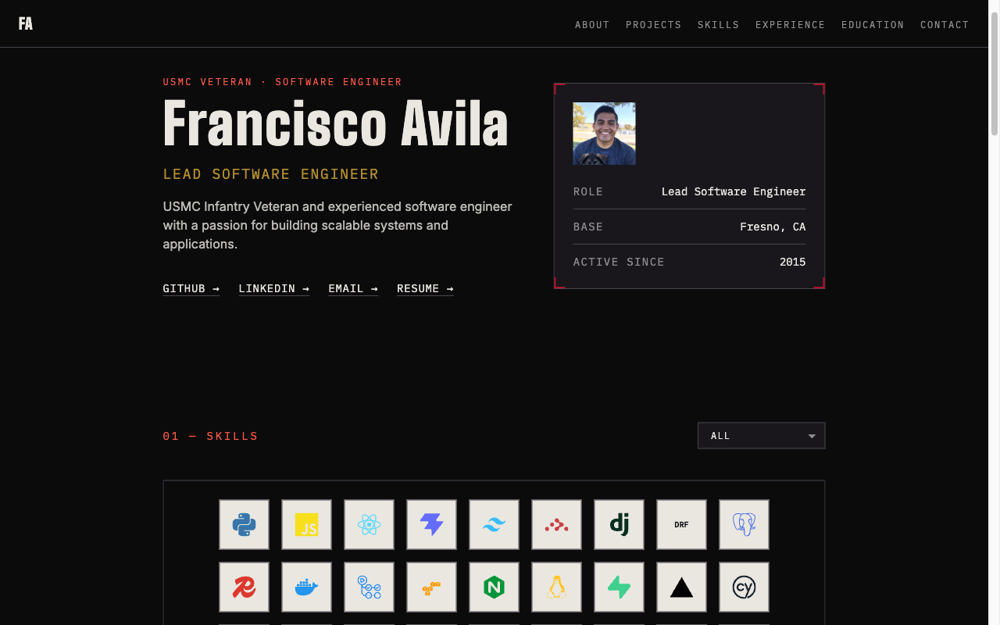

# AboutSection

The "hero" section of the portfolio site. Renders a two-column layout:

- **Left — `AboutHeader`**: an eyebrow line ("USMC Veteran · Software Engineer"), the person's name as a large display heading, their role/title, an optional italic tagline, a short bio paragraph, and a row of social links.
- **Right — `IdCard`**: a bordered "service record" card (the corner-bracket `.reticle` styling shared with `ProjectCard`) showing a photo (or initials fallback), and a `Role` / `Base` / `Active Since` field list.



## File layout

```
AboutSection/
  AboutSection.jsx        orchestrator — computes props, renders <AboutHeader/> + <IdCard/>
  subComponents/
    AboutHeader.jsx        left column
    IdCard.jsx              right column
  utilities.jsx            pure helper functions (no JSX)
  styles/
    tailwindStyles.jsx      shared Tailwind class-string constants
    aboutsection.css        placeholder (see note below)
  resources/
    about-section-desktop.png
```

## How it gets its data

`AboutSection.jsx` no longer imports `portfolio-data.json` or the asset files directly. `src/router.jsx`'s route `loader` (`loadPortfolioData`, in `src/utilities.jsx`) loads the JSON plus the `headshot.png`/`resume.pdf` assets once, and `App.jsx` hands the result to every routed page via `<Outlet context={...}>`. Since `AboutSection` is rendered inside `HomePage`, which is rendered inside that `<Outlet>`, it reads everything with a single `useOutletContext()` call:

```js
const { data, headShot, resume } = useOutletContext()
```

`data` is the raw JSON (`data.about`, `data.socials`, `data.experience`, `data.education`); `headShot`/`resume` are the pre-resolved asset URLs.

## How it maps to `src/data/portfolio-data.json`

| JSON field | Consumed by | Notes |
| --- | --- | --- |
| `about.name` | `AboutHeader` (heading), `IdCard` (`alt` text / initials fallback) | |
| `about.title` | `AboutHeader` (role line), `IdCard` (`Role` row) | Same value, rendered in both places |
| `about.tagline` | `AboutHeader` | Only rendered if truthy — empty string in the current data, so it doesn't show today |
| `about.bio` | `AboutHeader` | |
| `about.location` | `IdCard` (`Base` row) | Only rendered if truthy |
| `about.photoUrl` | **Not used.** | See "Known discrepancy" below |
| `socials.github` / `socials.linkedin` / `socials.email` | `AboutHeader` | Rendered as the underlined link row; `email` becomes a `mailto:` link, the others open in a new tab |
| `experience[].dates`, `education[].dates` | `IdCard` (`Active Since` row) | Not rendered as lists here — only the earliest 4-digit year across both arrays is extracted (see `earliestYear` in `utilities.jsx`) |

### Known discrepancy: `photoUrl`

`portfolio-data.json`'s `about.photoUrl` field (currently `"./assets/headshot.png"`) is **not read** by this component. `AboutSection.jsx` instead uses the `headShot` value from `useOutletContext()` — the same `headshot.png` asset, but resolved once by the router loader rather than read from this JSON field — and always passes that to `IdCard`. `IdCard` only falls back to rendering initials when the `photoUrl` prop it receives is falsy — which never happens today, since that asset is always truthy. This is pre-existing behavior, preserved as-is (not a bug fix).

Similarly, the JSON's `socials` object has no `resume` key — `AboutSection.jsx` adds one at render time by merging in the `resume` value from context (the loader-resolved `resume.pdf` asset), which is why "Resume" shows up as a fourth link alongside GitHub/LinkedIn/Email.

## Styling

All visuals are Tailwind utility classes. The longer/repeated class strings live in `styles/tailwindStyles.jsx` as named exports (e.g. `headingClass`, `idCardWrapperClass`, `socialLinkClass`) rather than inline in JSX, so the two sub-components stay readable. Two classes are intentionally **not** defined here: `.reticle` and `.animate-hero-rise` are global styles in `src/index.css`, shared with other components (like `ProjectCard`), so they aren't duplicated per-component.

`styles/aboutsection.css` is a placeholder — the component has no bespoke CSS beyond Tailwind utilities today. It's still imported by `AboutSection.jsx` so it's wired into the build if a future change ever needs real component-scoped CSS (custom keyframes, pseudo-elements, etc.).
